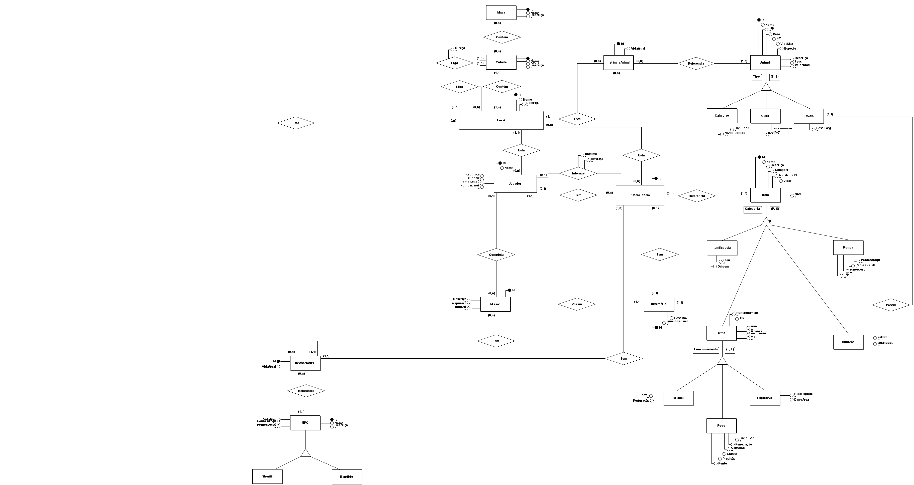

# Diagrama Entidade Relacionamento

O Diagrama de Entidade-Relacionamento (DER) destaca as principais entidades e seus relacionamentos. Esse diagrama organizacional ilustra as informações que fundamenta o funcionamento do jogo, detalhando a estrutura de dados essencial para o desenvolvimento.

Abaixo temos a imagem do diagrama de entidade relacionamento:

<!-- 
 -->
<!--[Versão Atual](../assets/v4.drawio.svg)-->
<!--  -->

## Histórico de Versão

| Versão | Data | Descrição | Autor(es) |
| :----: | :--------: | :-----------------------------------------------: | :---------------------------------------------------------------------------------------: |
| `1.0`  | 22/11/2024 | Primeira versão do Diagrama Entidade Relacionanemto | [Jefferson Sena](https://github.com/JeffersonSenaa) |
| `1.1`  | 23/11/2024 | Alguns ajustes e adicionais na versão inicial do Diagrama Entidade Relacionanemto | [Daniel Sousa](https://github.com/daniel-de-sousa) |
| `2.0`  | 23/11/2024 | Seguda versão do Diagrama Entidade Relacionanemto | [Daniel Sousa](https://github.com/daniel-de-sousa)  |
| `2.1`  | 23/11/2024 | Terceira versão do Diagrama Entidade Relacionanemto | [Luis Henrique](https://github.com/luishenrrique) |
| `2.2`  | 25/11/2024 | Atualização do Diagrama Entidade Relacionanemto | [Brenno da Silva](https://github.com/brenno-silva01)  |
| `3.0`  | 25/11/2024 | Diagrama Entidade Relacionanemto para a entrega 1 - Completo | [Daniel Sousa](https://github.com/daniel-de-sousa) |
| `3.1`  | 01/02/2025 | Diagrama Entidade Relacionanemto atualizado | [Daniel Sousa](https://github.com/daniel-de-sousa) |